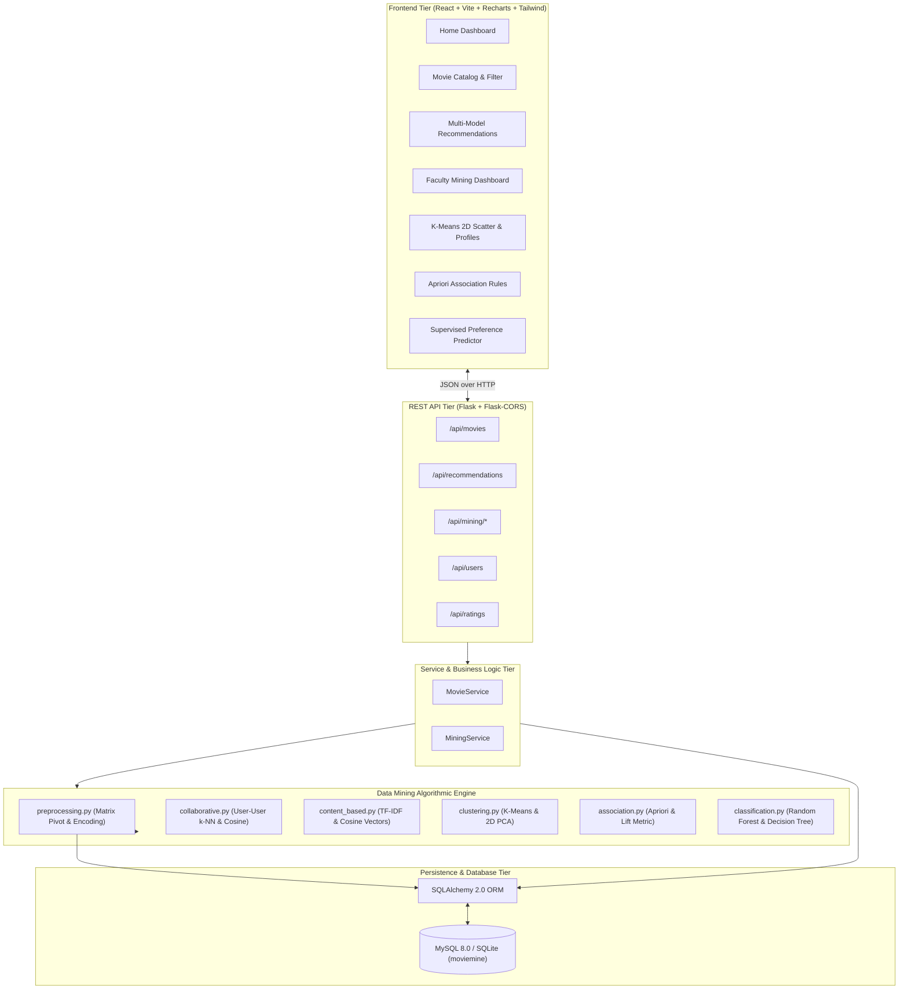
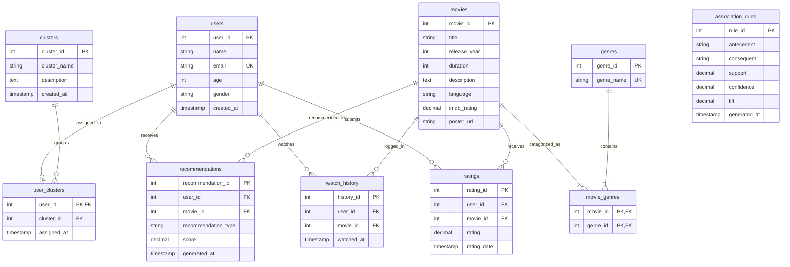

# MovieMine: System Architecture & Design Specification

> **Project Name:** MovieMine – Data Mining Based Movie Recommendation and User Preference Analysis System  
> **Course/Subject:** Data Mining & Business Intelligence / Machine Learning

---

## 1. System Overview & Multi-Tier Architecture

MovieMine is structured as a decoupled, multi-tier client-server architecture designed specifically for academic demonstration and reproducible Data Mining pipelines.

---

## 2. Relational Database Schema & Entity Relationships

The relational database enforces 3rd Normal Form (3NF) to support transactional integrity and analytical feature extraction.

---

## 3. The 5-Stage KDD Architecture Mapping

| KDD Stage | MovieMine Implementation Details |
| :--- | :--- |
| **1. Data Selection** | Dynamic extraction of records from tables `users`, `movies`, `ratings`, and `watch_history` via SQLAlchemy queries. |
| **2. Preprocessing** | Missing duration imputation, deduplication of user-movie ratings, text cleaning of plot overviews, and transaction basket extraction. |
| **3. Transformation** | Multi-label genre binarization, user mean-centering ($r_{ui} - \bar{r}_u$), TF-IDF matrix generation, and sparse user-item pivot matrix creation. |
| **4. Data Mining** | Scikit-Learn `KMeans` user segmentation, MLxtend `apriori` rule mining, Pearson correlation Collaborative Filtering, Cosine Similarity Content-Based filtering, and Random Forest classification. |
| **5. Evaluation & Interpretation** | 2D PCA cluster projection, Support/Confidence/Lift rule metrics, hybrid score composition, and interactive Recharts dashboard rendering. |

---

## 4. REST API Specification

### Movie Endpoints
- `GET /api/movies?page=1&per_page=16&genre=Action&sort_by=rating`: Paginated catalog with filters.
- `GET /api/movies/<id>`: Full movie details, average mined user rating, and total rating counts.
- `GET /api/genres`: List of all 18 unique movie genres.

### Recommendation Endpoints
- `GET /api/recommendations/<user_id>?top_n=8`: Computes and returns Hybrid, Collaborative, Content-Based, and Cluster-Popular recommendations.
- `POST /api/recommendations/content-based`: Computes top similar movies using Cosine Similarity for a given `movie_id` or `user_id`.
- `POST /api/recommendations/collaborative`: Computes User-User Collaborative Filtering recommendations for a given `user_id`.

### Data Mining Endpoints
- `GET /api/mining/statistics`: System KPI metrics, database counts, and genre frequency distribution.
- `POST /api/mining/cluster-users`: Body: `{"k": 4}`. Runs K-Means, computes 2D PCA projection coordinates, saves clusters, and returns centroid profiles.
- `GET /api/mining/clusters`: Returns current audience clusters and member counts.
- `POST /api/mining/association-rules`: Body: `{"min_support": 0.08, "min_confidence": 0.40, "min_lift": 1.0}`. Runs Apriori on transaction baskets and saves discovered rules.
- `GET /api/mining/association-rules`: Returns mined association rules.
- `POST /api/mining/classify-preference`: Body: `{"user_id": 1, "movie_id": 10}`. Predicts binary preference ("LIKED" vs "UNLIKELY TO PREFER") using Random Forest and Decision Tree classifiers.
- `POST /api/mining/pipeline/run-all`: Executes full end-to-end data mining pipeline for faculty viva demonstration.
