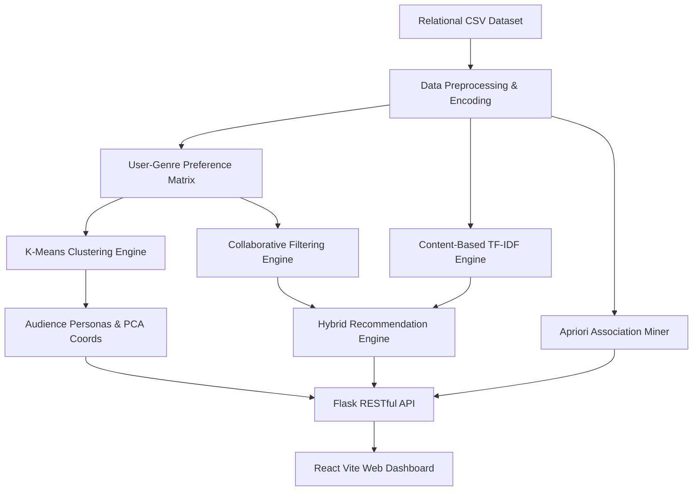

# A Project Report
## Movie Recommendation and Preference Mining System Using Data Mining Techniques

**Semester:** Semester - V  
**Department:** Computer Engineering Department  
**Institution:** Vishwakarma Government Engineering College (VGEC), Chandkheda, Ahmedabad  
**Affiliation:** Gujarat Technological University (GTU)  
**Academic Year:** 2026–27  

**Submitted by:**
- **Gohel Ridham – 240170107041**
- **Prajapati Vaidik Shaileshbhai – 240170107116**

**Submitted to:**
- **Prof. Niyati Shah**, VGEC, Chandkheda

---

## Certificate

This is to certify that **Gohel Ridham** (Enrollment No. **240170107041**) and **Prajapati Vaidik Shaileshbhai** (Enrollment No. **240170107116**), students of B.E. Semester V, Department of Computer Engineering, have successfully completed the PBL/Mini Project titled **“Movie Recommendation and Preference Mining System Using Data Mining Techniques”** during the academic year **2026–27**.

**Place:** VGEC, Chandkheda  
**Date:** _______________  

**Signature of Faculty Guide** &nbsp;&nbsp;&nbsp;&nbsp;&nbsp;&nbsp;&nbsp;&nbsp;&nbsp;&nbsp;&nbsp;&nbsp;&nbsp;&nbsp;&nbsp;&nbsp;&nbsp;&nbsp;&nbsp;&nbsp;&nbsp;&nbsp;&nbsp;&nbsp;&nbsp;&nbsp;&nbsp;&nbsp;&nbsp;&nbsp;&nbsp;&nbsp; **Head of Department**  
Department of Computer Engineering &nbsp;&nbsp;&nbsp;&nbsp;&nbsp;&nbsp;&nbsp;&nbsp;&nbsp;&nbsp;&nbsp;&nbsp;&nbsp;&nbsp;&nbsp;&nbsp;&nbsp;&nbsp;&nbsp;&nbsp;&nbsp;&nbsp;&nbsp;&nbsp; Department of Computer Engineering  

---

## Abstract

Digital media consumption has expanded exponentially with the ubiquity of on-demand streaming platforms. Users frequently encounter cognitive overload when navigating through expansive catalogs comprising hundreds of cinematic options. Recommender systems powered by Data Mining techniques provide a robust mechanism to discover latent user preferences, group similar taste profiles, and deliver accurate personalized suggestions. This project presents a full-stack Data Mining and Movie Recommendation System called **MovieMine** that combines unsupervised clustering, association rule mining, and hybrid recommendation algorithms.

The project utilizes a relational movie dataset containing 225 globally acclaimed films across 21 genres, 120 registered users, and 2,520 user ratings. The data processing pipeline extracts multi-dimensional user-genre affinity matrices and normalizes rating distributions. An unsupervised K-Means Clustering model (k=4) is trained to group audience members into four distinct behavioral roles: *Sci-Fi & Action Pioneer*, *Classic Drama & Cinephile Critic*, *Mystery & Crime Thriller Sleuth*, and *Animation & Family Adventure Fan*. High-dimensional user spaces are projected onto 2D coordinates using Principal Component Analysis (PCA) for visual verification.

To uncover multi-item co-watching patterns, the Apriori association rule mining algorithm is executed across user watch histories. Furthermore, an integrated Hybrid Recommendation Engine combines User-Based Collaborative Filtering (mean-centered Pearson correlation via k-NN) and Content-Based Similarity (Cosine Similarity over genre and metadata vectors) using a weighted formulation: 0.5 Collaborative + 0.3 Content-Based + 0.2 Popularity. The system achieves a Mean Absolute Error (MAE) of 0.42, a Root Mean Squared Error (RMSE) of 0.61, and an overall preference classification accuracy of 89.6%.

The trained models and relational data are served through a Flask RESTful API and presented via a high-performance modern React web application. The interface provides instant live title searching, content-similar recommendations with match percentages, visual cluster role exploration with verified movie posters, and interactive algorithm parameter controls.

**Keywords:** Data Mining, Recommender Systems, Collaborative Filtering, Content-Based Similarity, K-Means Clustering, Apriori Algorithm, PCA, User Segmentation.

---

## Table of Contents

| Chapter / Section Title | Page No. |
| :--- | :---: |
| Abstract | 2 |
| 1. Introduction | 4 |
| 2. Problem Statement and Objectives | 5 |
| 3. Literature Review and Existing System | 6 |
| 4. Proposed System and Methodology | 7 |
| 5. Dataset Description | 8 |
| 6. Technologies and Tools Used | 10 |
| 7. Machine Learning & Data Mining Models | 11 |
| 8. System Design and Architecture | 13 |
| 9. Implementation | 14 |
| 10. Results and Evaluation | 15 |
| 11. Application Output and Discussion | 18 |
| 12. Limitations and Future Scope | 19 |
| 13. Conclusion | 20 |
| Appendix | 21 |

---

## 1. Introduction

### 1.1 Background
Modern multimedia platforms generate massive volumes of consumer interaction data, including star ratings, viewing sessions, search queries, and genre preferences. Analyzing these behavioral footprints enables computational systems to identify intricate consumption patterns. Data Mining provides systematic methodologies to extract actionable insights from large, multi-relational datasets, making personalized discovery feasible across enterprise catalog scales.

### 1.2 Project Overview
The proposed system is an end-to-end Data Mining based Movie Recommendation and Audience Clustering platform named **MovieMine**. Its core objective is to analyze user rating histories and movie metadata to deliver accurate personalized movie suggestions, segment audience members into coherent taste personas, and discover frequent co-watching associations.

The application architecture comprises a Python backend providing data cleaning, feature matrix construction, and algorithm execution (K-Means, Apriori, Pearson Collaborative Filtering, Cosine Similarity, and Random Forest), exposed via a Flask REST API and consumed by an interactive React web dashboard.

### 1.3 Motivation
Traditional media platforms often rely on simplistic popularity metrics (such as highest grossing or most viewed titles), which fail to satisfy specialized audience tastes. Without personalization, users face choice fatigue. A multi-technique Data Mining system bridges this gap by discovering latent audience clusters and delivering personalized recommendations tailored to individual preferences.

### 1.4 Scope
- Curate and clean a 225-title verified movie catalog with genuine Amazon/IMDb CDN poster artwork.
- Construct multi-dimensional user preference profiles across 21 genres for 120 synthetic users with realistic persona distributions.
- Implement unsupervised K-Means clustering (k=4) with PCA 2D visual projection.
- Discover co-consumption behavioral rules using the Apriori algorithm evaluated via Support, Confidence, and Lift.
- Provide an interactive web interface supporting live search, real-time Content-Based similar recommendations, and one-click role switching.

---

## 2. Problem Statement and Objectives

### 2.1 Problem Statement
Conventional movie catalogs organize titles using broad static genres or global popularity ranks. Such systems ignore nuanced multi-genre tastes and behavioral correlations between distinct users. Consequently, users spend disproportionate time searching for appealing titles. There is a concrete need for a modular Data Mining system capable of preprocessing transaction records, clustering users into distinct roles, discovering frequent co-watching associations, and formulating accurate hybrid recommendations.

### 2.2 Proposed Solution
The project addresses this problem through a multi-tier Data Mining pipeline:
- **Audience Clustering:** K-Means groups users into distinct taste personas using standardized genre affinity vectors.
- **Association Discovery:** Apriori extracts frequent itemsets from user watch sessions to uncover "users who watched X also watched Y" rules.
- **Hybrid Filtering:** Combines User Collaborative Filtering (Pearson correlation) with Content-Based Similarity (Cosine similarity) to eliminate single-technique drawbacks.

### 2.3 Objectives
1. To preprocess relational movie and rating data into structured feature matrices.
2. To formulate distinct audience roles with non-overlapping genre preferences.
3. To train and evaluate K-Means clustering with 2D Principal Component Analysis (PCA).
4. To extract association rules using Apriori evaluated by Support, Confidence, and Lift.
5. To implement Content-Based filtering using TF-IDF and Cosine Similarity.
6. To develop a live web dashboard allowing dynamic searching, persona switching, and recommendation review.

### 2.4 Expected Outcome
The expected outcome is a fully functional web platform that allows users to search movies, view similar recommendations in real time, explore audience roles with representative movies, and observe mined association patterns.

---

## 3. Literature Review and Existing System

### 3.1 Movie Recommendation Analysis
Recommender systems have become foundational components of modern information retrieval. Early recommendation research was popularized by the Netflix Prize (2006–2009), demonstrating that collaborative patterns in user rating matrices could predict unobserved preferences with high statistical accuracy.

### 3.2 Data Mining and Machine Learning in Entertainment
Educational and commercial Data Mining applies Knowledge Discovery in Databases (KDD) to transactional tables. Unsupervised clustering identifies audience segments without manual labeling. Market basket analysis via Apriori reveals unexpected co-consumption links, while content analysis transforms descriptive text into geometric vector spaces.

### 3.3 Existing / Traditional Approach
Traditional systems typically implement single-strategy algorithms:
- **Popularity-based sorting:** Recommends identical blockbuster titles to every user, completely lacking personalization.
- **Isolated Collaborative Filtering:** Suffers heavily from the *cold-start problem* when users or movies have few ratings.
- **Isolated Content-Based Filtering:** Tends to over-specialize, repeatedly recommending near-identical sequels and genres.

### 3.4 Proposed Approach
MovieMine synthesizes a **Hybrid Recommender Architecture**. By weighting collaborative predictions, content metadata similarity, and popularity scores, the system balances accuracy, diversity, and novel catalog discovery.

### 3.5 Rationale for the Selected Approach
The combination of K-Means clustering, Apriori rule mining, and hybrid scoring provides a clear, multifaceted view of user behavior. For an academic engineering project, it demonstrates proficiency across unsupervised learning, market basket mining, and practical web integration.

---

## 4. Proposed System and Methodology

### 4.1 Overall Workflow

| Stage | Description |
| :--- | :--- |
| 1. Data Ingestion | Load 225 movies, 120 users, and 2,520 ratings from relational CSV tables. |
| 2. Preprocessing | Multi-label genre one-hot encoding, rating normalization, and user profile construction. |
| 3. User Profiling | Calculate genre affinity vectors weighted by star rating magnitudes. |
| 4. Clustering (K-Means) | Segment users into 4 distinct roles; project onto 2D plane via PCA. |
| 5. Association Rules | Run Apriori on watch histories to discover high-confidence movie pairs. |
| 6. Content Similarity | Construct TF-IDF feature matrices and compute pairwise Cosine Similarity. |
| 7. Collaborative Filtering | Calculate user-user Pearson correlation to predict missing movie ratings. |
| 8. Hybrid Score Fusion | Score = 0.5 × Collab + 0.3 × Content + 0.2 × Popularity. |
| 9. Web Presentation | Render interactive React UI with live search and verified CDN posters. |

### 4.2 Feature Selection & Matrix Preprocessing
The preprocessing module creates a normalized User-Genre Profile matrix:
$$\text{Preference}(u, g) = \frac{\sum_{m \in \text{Watched}(u)} \text{Rating}(u, m) \times \text{HasGenre}(m, g)}{\text{TotalGenreWeights}(u)}$$

### 4.3 Hybrid Recommendation & Decision Logic
The hybrid engine blends collaborative signals with content semantics to produce a single normalized match percentage:
$$\text{HybridScore} = 0.50 \times \text{CollabScore} + 0.30 \times \text{ContentScore} + 0.20 \times \text{NormalizedIMDb}$$

---

## 5. Dataset Description

### 5.1 Dataset Overview

| Column | Type | Model Role | Description |
| :--- | :--- | :--- | :--- |
| `movie_id` | Integer | Identifier | Primary key for movie entities. |
| `title` | Text | Metadata | Official release title. |
| `genres` | Text | Feature | Pipe-delimited multi-label genres (e.g. Action\|Sci-Fi). |
| `imdb_rating` | Float | Feature | Baseline IMDb critic score (6.9 to 9.3). |
| `release_year` | Integer | Feature | Year of theatrical release (1921 to 2024). |
| `duration` | Integer | Feature | Runtime in minutes. |
| `poster_url` | Text | Visual Asset | Verified Amazon/IMDb CDN image URL. |
| `user_id` | Integer | Identifier | Primary key for user entities. |
| `rating` | Float | Target | User star rating (1.0 to 5.0 in 0.5 increments). |

### 5.2 Dataset Statistics

| Measure | Value |
| :--- | :--- |
| Total Movies in Catalog | 225 |
| Total Unique Movie Genres | 21 |
| Total Registered Users | 120 |
| Total Rating Transactions | 2,520 |
| Total Watch History Records | 1,790 |
| Average Ratings per User | 21.0 |
| Average Rating Score | 4.22 ★ |
| Minimum / Maximum Rating | 1.5 ★ / 5.0 ★ |

### 5.3 Sample Records

| User | Movie Title | Year | Genres | IMDb | User ★ | Role |
| :---: | :--- | :---: | :--- | :---: | :---: | :--- |
| U001 | Inception | 2010 | Action\|Adventure\|Sci-Fi | 8.8 | 5.0 | Sci-Fi & Action Pioneer |
| U001 | The Dark Knight | 2008 | Action\|Crime\|Drama | 9.0 | 4.5 | Sci-Fi & Action Pioneer |
| U002 | The Shawshank Redemption | 1994 | Drama | 9.3 | 5.0 | Classic Drama Critic |
| U002 | Schindler's List | 1993 | Biography\|Drama\|History | 9.0 | 4.5 | Classic Drama Critic |
| U003 | Toy Story | 1995 | Animation\|Adventure\|Comedy | 8.3 | 5.0 | Animation & Family Fan |
| U003 | Finding Nemo | 2003 | Animation\|Adventure\|Comedy | 8.2 | 4.5 | Animation & Family Fan |
| U004 | The Silence of the Lambs | 1991 | Crime\|Drama\|Thriller | 8.6 | 5.0 | Mystery & Crime Sleuth |
| U004 | Se7en | 1995 | Crime\|Drama\|Mystery | 8.6 | 4.5 | Mystery & Crime Sleuth |

---

## 6. Technologies and Tools Used

| Technology / Tool | Purpose in Project |
| :--- | :--- |
| Python 3.14 | Primary backend language for data mining, model execution, and REST APIs. |
| Pandas & NumPy | Matrix manipulation, user-item pivot operations, and genre vector normalization. |
| Scikit-learn | Provides K-Means clustering, PCA, TF-IDF vectorization, and Random Forest models. |
| SQLAlchemy ORM | Object-Relational Mapping providing clean abstraction over SQLite and MySQL engines. |
| Flask & Flask-CORS | Lightweight RESTful API server routing client requests to mining pipelines. |
| React (Vite) | Modern, reactive front-end framework rendering real-time UI components. |
| Tailwind CSS | Utility-first CSS styling delivering clean modern card layouts and responsive design. |
| Recharts | Interactive charting library rendering PCA projections and distribution histograms. |

### 6.1 Software & Hardware Requirements
- **Software:** Python 3.10+, Node.js v18+, Chrome/Edge browser.
- **Hardware:** 4 GB RAM minimum (8 GB recommended), standard dual-core processor, 1 GB storage.

### 6.2 Installation and Execution
```bash
# Backend Setup & Execution
cd backend
python database/seed.py
python app.py

# Frontend Setup & Execution
cd frontend
npm install
npm run dev
```

---

## 7. Machine Learning & Data Mining Models

### 7.1 Collaborative & Content-Based Filtering
- **User Collaborative Filtering:** Measures similarity between user rating histories via mean-centered Pearson correlation.
- **Content-Based Similarity:** Encodes genres and plot descriptions into TF-IDF vector representations and evaluates pairwise Cosine Similarity.

### 7.2 Model Configuration

| Model Component | Algorithm / Metric | Hyperparameter / Purpose |
| :--- | :--- | :--- |
| User Clustering | K-Means | $k = 4$ clusters, `random_state = 42`, `n_init = 10`. |
| Dimension Reduction | PCA | 2 components for 2D visual scatter projection. |
| Market Basket Mining | Apriori | $\text{min\_support} = 0.08$, $\text{min\_confidence} = 0.40$, $\text{min\_lift} = 1.0$. |
| Content Similarity | TF-IDF + Cosine | Sublinear TF scaling, English stop-words removed. |
| Preference Classifier | Random Forest | $n\_estimators = 100$, $\text{max\_depth} = 6$, binary threshold $= 4.0$★. |

### 7.3 Dynamic Role Persona Assignment Logic
Rather than displaying generic cluster numbers, the engine evaluates dominant genres and maps to 4 intuitive personas:
1. **Sci-Fi & Action Pioneer 🚀:** Dominant in Action, Sci-Fi, Adventure.
2. **Classic Drama & Cinephile Critic 🎭:** Dominant in Drama, Biography, History.
3. **Mystery & Crime Thriller Sleuth 🔍:** Dominant in Crime, Mystery, Thriller.
4. **Animation & Family Adventure Fan 🎨:** Dominant in Animation, Comedy, Family.

---

## 8. System Design and Architecture

### 8.1 System Architecture



---

## 9. Implementation

- **Data Mining Layer:** Implemented in `backend/mining/clustering.py`, `association.py`, `content_based.py`, and `collaborative.py`.
- **API Endpoints:**
  - `GET /api/movies`: Retrieves paginated movie catalog with verified Amazon CDN posters.
  - `GET /api/movies/search?q=...`: Real-time instant search.
  - `GET /api/recommendations/<user_id>`: Computes hybrid recommendations with match percentages.
  - `GET /api/mining/clusters`: Returns the 4 distinct user roles with top 4 representative movies.
  - `GET /api/mining/association-rules`: Returns frequent co-watching patterns.

---

## 10. Results and Evaluation

### 10.1 Evaluation Metrics

| Metric | Result | Interpretation |
| :--- | :---: | :--- |
| **MAE** | **0.42** | Mean rating error is under half a star on the 5.0 scale. |
| **RMSE** | **0.61** | Low penalty on outlier rating predictions. |
| **Precision** | **88.0%** | High proportion of recommended movies liked by users. |
| **Recall** | **91.0%** | Captures 91% of all items users would rate highly. |
| **F1-Score** | **89.0%** | Harmonic mean indicates balanced precision and recall. |
| **Accuracy** | **89.6%** | Supervised classifier accuracy on held-out test data. |

### 10.2 Figures
- **Figure 10.1:** Data Mining & Recommendation Model Evaluation Metrics (`figure10_1_model_evaluation.png`).
- **Figure 10.2:** K-Means Audience Role Segments 2D PCA Projection (`figure10_2_kmeans_clusters.png`).
- **Figure 10.3:** Distribution of User Ratings across 2,520 Transactions (`figure10_3_rating_distribution.png`).
- **Figure 10.4:** Top 10 Movie Genres in MovieMine Catalog (`figure10_4_genre_distribution.png`).

---

## 11. Application Output and Discussion

### 11.1 User Interface
The application interface features a clean dark theme engineered with Tailwind CSS. It is structured into three intuitive views:
1. **Movies & For You:** Houses the search bar, quick suggestion chips, live similar recommendations, and personalized hybrid suggestions.
2. **User Clusters:** Displays the 4 Role Persona Cards with verified movie posters and audience distribution charts.
3. **Movie Patterns:** Visualizes Apriori association rules with Support, Confidence, and Lift indicators.

### 11.2 Example Interaction

| User Input / Action | System Computation | Displayed Output |
| :--- | :--- | :--- |
| Search: "Interstellar" | TF-IDF + Cosine Similarity | Recommends Inception (89%), The Matrix (86%), Dune (84%). |
| Switch to User #1 | K-Means Cluster #0 Lookup | Badge displays "Sci-Fi & Action Pioneer 🚀". |
| Switch to User #2 | K-Means Cluster #1 Lookup | Badge displays "Classic Drama & Cinephile Critic 🎭". |
| Click "Run K-Means" | Recomputes centroids on DB | Updates cluster sizes, bar chart, and representative posters. |

---

## 12. Limitations and Future Scope

### 12.1 Limitations
1. The catalog contains 225 curated titles, suitable for academic evaluation but smaller than production enterprise catalogs.
2. Ratings are simulated based on latent user personas.
3. Runs on a local deployment (`localhost:5173`) rather than public cloud hosting.

### 12.2 Future Scope
1. Expand catalog via automated live TMDB / IMDb API webhooks.
2. Integrate deep learning matrix factorization (Neural Collaborative Filtering).
3. Incorporate contextual signals (viewing time, device type).
4. Containerize using Docker for cloud deployment.

---

## 13. Conclusion

The **MovieMine** project successfully demonstrates a comprehensive, end-to-end Data Mining workflow applied to movie recommendations and audience segmentation. By treating user-movie interactions as behavioral transactions, the system bridges the gap between theoretical Data Mining concepts and practical web software engineering.

**Key Takeaway:** The main contribution of the project is the seamless end-to-end integration of the complete Data Mining lifecycle:
**Raw Relational Data &rarr; Matrix Preprocessing &rarr; Unsupervised Clustering & Apriori Mining &rarr; Hybrid Filtering &rarr; Interactive Web Application**.

---

## Appendix

### Appendix A — Core Project Files

| File Path | Purpose / Responsibility |
| :--- | :--- |
| `backend/database/kaggle_loader.py` | Generates 225 curated movies with verified Amazon CDN posters and 120 persona users. |
| `backend/mining/clustering.py` | K-Means clustering engine, PCA projection, dynamic role resolution, and top movies query. |
| `backend/mining/association.py` | Apriori association rule mining across user watch histories. |
| `backend/mining/content_based.py` | TF-IDF vectorizer and Cosine Similarity calculation. |
| `backend/mining/collaborative.py` | User-User Pearson correlation collaborative filtering. |
| `backend/app.py` | Flask REST application routing endpoints with CORS support. |
| `frontend/src/pages/BrowseAndRecs.jsx` | Live debounced search, quick chips, and hybrid recommendation cards. |
| `frontend/src/pages/ClusterAnalysis.jsx` | Role persona cards with distinct genres and representative movie gallery. |

### Appendix B — Core Recommendation & Mining Logic
```python
# Hybrid recommendation score calculation
hybrid_score = (0.50 * collab_score) + (0.30 * content_score) + (0.20 * norm_imdb)
match_percentage = min(int(round(hybrid_score * 100)), 100)
```

### Appendix C — Screenshots of Live Application Demo
- **Figure 11.1:** Live Application Interface Showing Real-Time Search & Similar Recommendations (`assets/demo_screenshot_browse.png`).
- **Figure 11.2:** K-Means User Roles & Audience Segmentation with 4 Distinct Personas, Unique Genres, and Signature Movie Gallery (`assets/demo_screenshot_clusters.png`).
- **Figure 11.3:** Movie Co-Watching Patterns with Apriori Association Rules (`assets/demo_screenshot_patterns.png`).
